# Spectrumind - Introduction

**Welcome to Spectrumind** 

 This website is transformative online platform dedicated to promoting pride representation, raising awareness about mental health, and fostering well-being within the LGBTQ+ community and beyond. Our project is fueled by a deep commitment to creating a more inclusive and compassionate world, where every individual feels seen, accepted, and supported.

 **Our Mission** 
1. **Pride Representation:** At Spectrumind, we strive to celebrate the rich diversity of identities within the LGBTQ+ community. Our aim is to provide a safe space where individuals can freely express their authentic selves, share their stories, and find inspiration. Through empowering narratives, vibrant artwork, and engaging content, we aim to amplify voices that have been marginalized and break down societal barriers.
2. **Mental Health Awareness:** We recognize the profound impact that mental health has on the well-being of individuals, especially those within the LGBTQ+ community. Spectrumind is dedicated to shedding light on the unique challenges faced by this community and providing resources, support, and information to help navigate those struggles. Our goal is to reduce stigma, foster understanding, and create a culture of empathy and acceptance.
3. **Well-being and Empowerment:** Spectrumind believes in the power of holistic well-being. We aim to empower individuals by providing tools, resources, and guidance that promote self-care, personal growth, and resilience. Our goal is to nurture a community where mental, emotional, and physical well-being are prioritized, leading to a stronger and more vibrant community overall.

You can view the live site here: [Spectrumind](https://spectrumind-9674c855da30.herokuapp.com/)

---

## CONTENTS

* [User Experience](#user-experience-ux)
  * [User Stories](#user-stories)
  * [Agile Methodology](#agile-methodology)

* [Design](#design)
  * [Colour Scheme](#colour-scheme)
  * [Typography](#typography)
  * [Imagery](#imagery)
  * [Wireframes](#wireframes)

* [Features](#features)
  * [General Features on Each Page](#general-features-on-each-page)
  * [Future Implementations](#future-implementations)
  * [Accessibility](#accessibility)

* [Technologies Used](#technologies-used)
  * [Languages Used](#languages-used)
  * [Frameworks, Libraries & Programs Used](#frameworks-libraries--programs-used)

* [Testing](#testing)
  * [Manual Testing](#manual-testing)
  * [Automated Testing](#automated-testing)

* [Deployment](#deployment)

* [Credits](#credits)
  * [Code Used](#code-used)
  * [Media](#media)
  * [Acknowledgments](#acknowledgments)

---

## User Experience (UX)

A group of unlikely coders with various abilities came together to produce a website dedicated to representing the LGBTQ+ community and bring awareness to others about the struggles encountered by the community throughout history and up to the current day.
The concept of the name Spectrumind developed from the idea of connecting mental wellness and the human brain and associating the light spectrum to a community defined by its rainbow colors.
Key information for the site
•	What does it mean to be a part of the LGBTQ+.
•	How can we support members of the LGBTQ+ community who suffer with feeling ostracized by society.
•	Where can we learn about the history and accomplishments of the community as well as important figures and icons.
•	What can we do to help people who struggle to understand their role in the community.
•	When do events happen throughout the year that promote awareness.

### User Stories

**Users Goals**

*	To be able to view the site on a range of device sizes.
*	To make it easy for people who wish to learn more about the LGBTQ+ community and make the site more accessible and understandable.
*	To make the content and information clear, easy and concise for all users.
*	To provide accessible and user-friendly links that help those in need of council.  
First Time Visitor Goals
*	I want to find out more about the LGBTQ+ community and how I can support them.
*	I want to be able to easily navigate through the website's pages, so that I can find the information I'm looking for.
*	I want to be able to find their social media profiles with ease.
Returning Visitor Goals
*	I want to find up to date information on current LGBTQ+ news and events.
*	I want to be able to find necessary links to get help or find someone to talk to, so that I can get help if needed for my mental health.
Frequent Visitor Goals
*	I want to be able to follow current events regarding the LGBTQ+ community..

**Admin Goals**

*	Create an early deployment to be able to deliver early results to client and users following Agile principles.
*	Set up the backend so i can able to create a site admin dashboard and manage page.

### Agile methodology

The Agile methodology was chosen for this project to ensure flexibility and responsiveness to changes that may arise during the development process. It is used Github and the Project Board to implement Agile practices. User stories were initially entered into the 'To Do' column on the Kanban board, which served as the project's backlog. As development progressed, user stories were moved into the 'In Progress' column. Once a user story was fully developed, it was moved to the 'Done' column. This process allowed for continuous development and testing, with the ability to pivot and make changes as needed. Overall, the use of Agile methodology and the Kanban board in Github was effective in keeping the work organized and on task, resulting in a successful project.

Please find GitHub Kanban Board with User Stories and Tasks [here.](https://github.com/users/Edmir-Demaj/projects/5)

<details><summary>Please view the Issues:</summary>
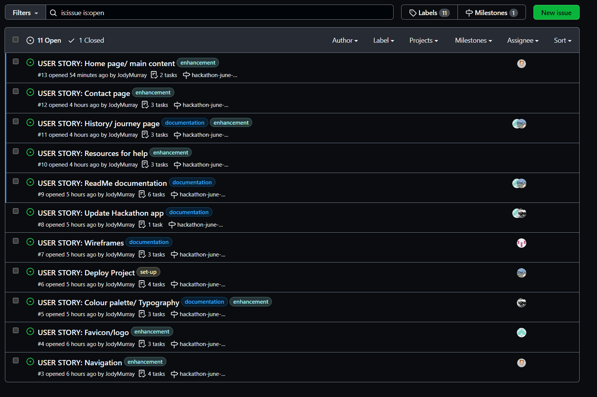
</details>

<details><summary>Please view Milestone project:</summary>
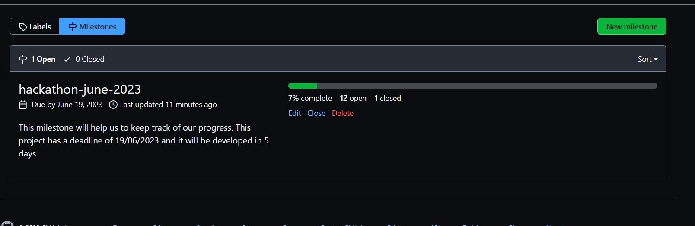
</details>

## Design

### Colour Scheme

The color palette comprising FF5252 (red), E1BEE7 (pink), 114069 (navy blue), C2DFE8 (light blue), and BC5BBC (purple) was selected for the project "SpectrumInd" to represent LGBTQ pride for several reasons. Firstly, the color red (FF5252) is often associated with love, passion, and solidarity, reflecting the strong emotions and sense of unity within the LGBTQ community. The pink shade (E1BEE7) symbolizes inclusivity, tenderness, and understanding, promoting a welcoming atmosphere for diverse identities. Navy blue (114069) signifies strength and stability, highlighting the resilience and courage of LGBTQ individuals. Light blue (C2DFE8) represents serenity, tranquility, and harmony, underscoring the peaceful coexistence and acceptance of different sexual orientations and gender identities. Lastly, purple (BC5BBC) embodies creativity, pride, and diversity, reflecting the unique and vibrant spectrum of LGBTQ experiences. Together, this color palette embodies the values of the LGBTQ community and visually represents the pride and celebration of their identities within the "SpectrumInd" project.
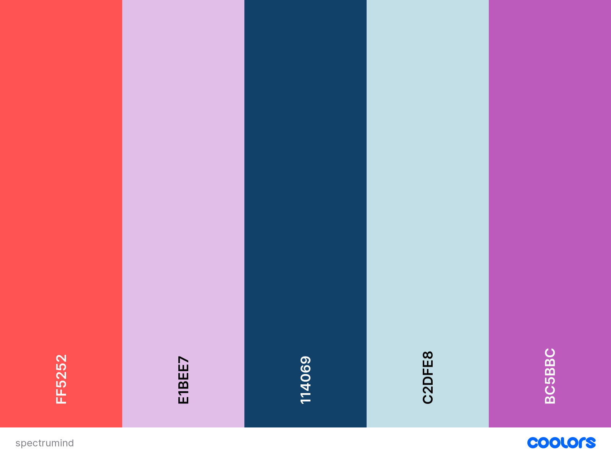

### Typography

Google Fonts was used for the following fonts

Amatic and Josefin fonts are the main fonts used throughout the whole website with Sans Serif as the fallback font in case for any reason the font isn't being imported into the site correctly. Amatic and Josefin are clean fonts used frequently in programming, so they are both attractive and appropriate.

### Imagery

All images used on this project are free copyrights. They are used within the site has been chosen to showcase the LGBTQ+ community. The images are also used to add visual interest to the website and to help break up different sections of the page. Imagery is relevant to the content and mission of the website and is also appropriately sized and optimized for web use to ensure fast page loading times. 

### Wireframes

All of the mock up designs for the web app were created using [Figma](https://www.figma.com/), a popular design tool known for its versatility and collaborative features. During design stage was kept in mind the principles of UX (User Experience) and UI (User Interface) design throughout the process to ensure that designs are intuitive, user-friendly, and visually appealing. Additionally, the mock up designs are responsive and optimized for use on tablets and mobile devices, to provide a seamless experience across different screen sizes. Personally, I find it very helpful to create a mockup design rather than a wireframe when I began a project, it helps a lot with styling, colours, layout during development.

<details><summary>Home Page:</summary>
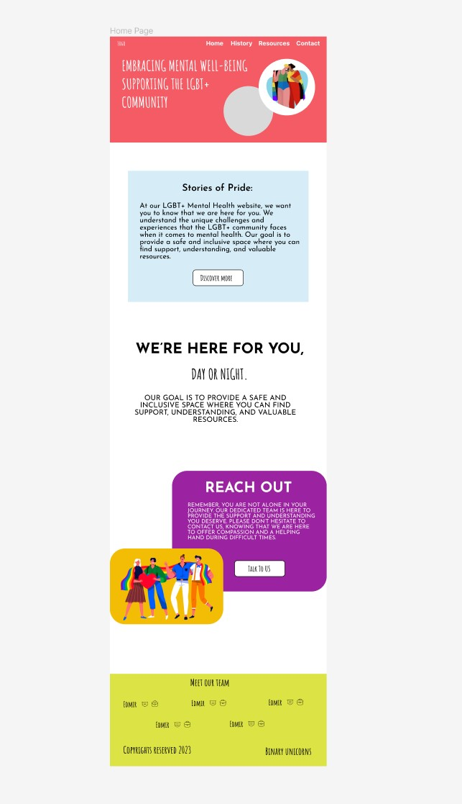
</details>
<details><summary>History Page:</summary>
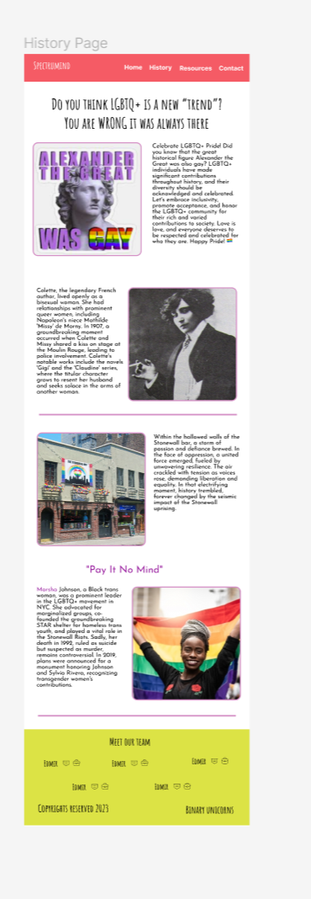
</details>
<details><summary>Resources Page:</summary>
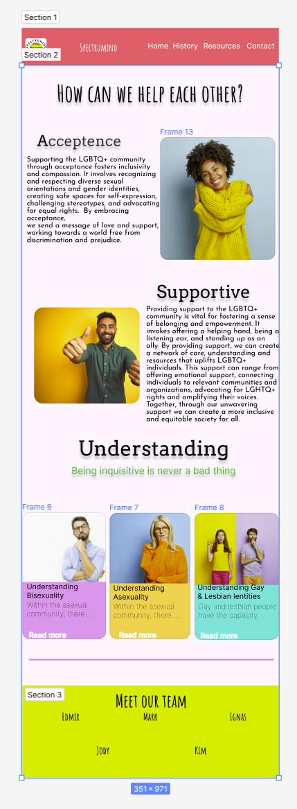
</details>
<details><summary>Contact Page:</summary>
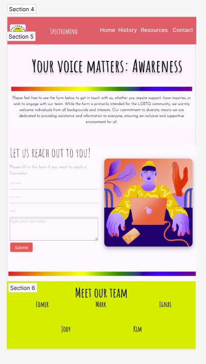
</details>

--- 

[Back to top ⇧](#contents)

## Features

**Home Page**
### Navbar
On the landing page, users will be presented with a visually appealing and user-friendly navbar positioned at the very top. This navbar contains all the necessary links and accessibility options for easy navigation and is fully responsive. On the very left side is positioned the Logo of the website. Navbar is kept same in all the pages for ease of navigation.


### Hero Section
Creating a strong first impression with the user is crucial, and to achieve this, a hero image with 100% screen width and 60% screen height was employed. This hero image acts as an introduction to site, displaying two distinct images accompanied by engaging heading that effectively communicate the purpose and essence of the web app. The design is fully responsive, ensuring seamless adaptation. 
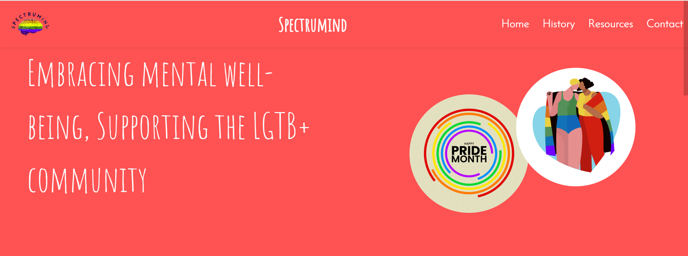

### Histories of Pride
Histories of Pride is another feature on home page providing to users more information about LGBTQ+ community and sharing the story journey. This section is center aligned and has a button to redirect to histroy page in order to get more information about this community.
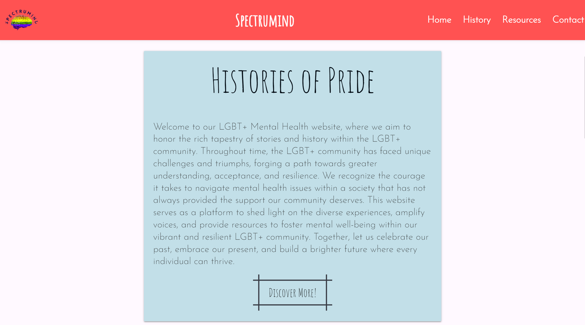

### Reach out
A vry important feature laying on home page is reachout to us section. This section consists on an image representin pride with colours and smiles, showing the importance of staying healthy and happy by being accepted. 'Talk to us' button will redirect to Resources page for additional professional resources seeking help about mental health and wellness.
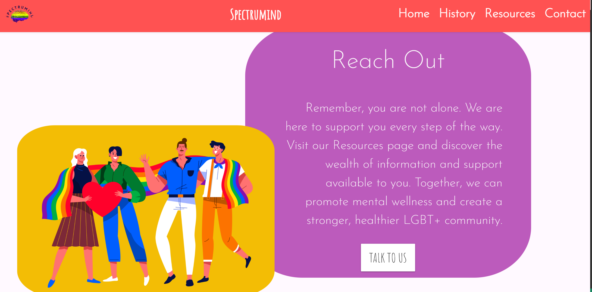

### Footer

Footer is another feature used on this website. It always stick to the bottom of the page with a strong blue background which aligns well with LGBTQ+ flag colours. This feature contains all team members who worked to built this site and their links to GitHub and LinkedIn profiles. As well includes copyrights and the team name Binary uNICORNS. 
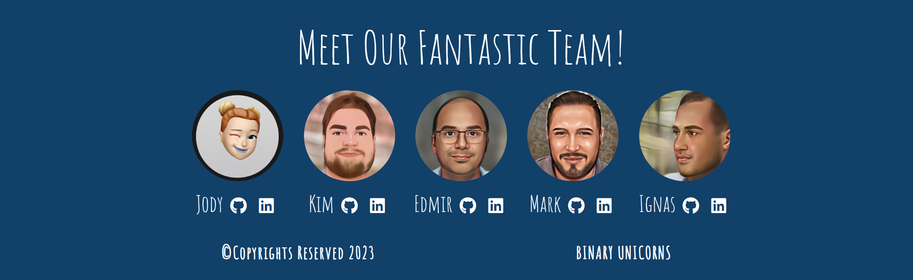

---

**History Page**

### History section
On the second page which is History page, user will be presented with a short introduction to history of Pride community. This will show that this 'phenomen' was always presented and between us so we have facts that the Great Alexander was gay. This is powerful to show Pride representation, acceptance in social life, to show that they are no different than all of us.
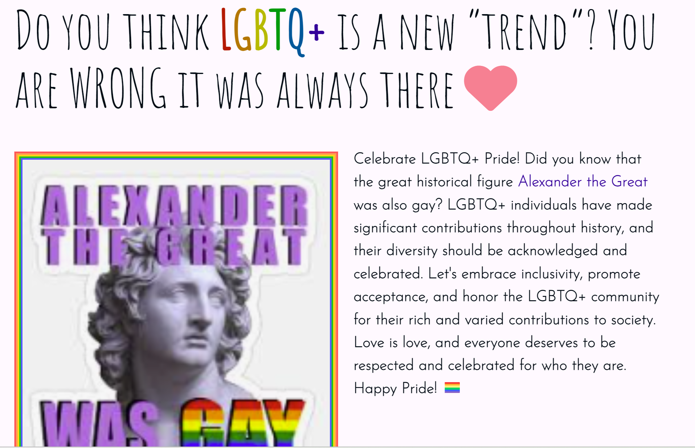

### Moments to remember
This feature provides information about two historical moments that made revolution about LGBTQ+, one of them is Stonewall bar and the other is Marsha Johnson. This two sections complete the history journey by showing to users the challenges this community went through so can raise awareness and importance of mental health. Fully responsive and friendly user-interface was implemented on this page.
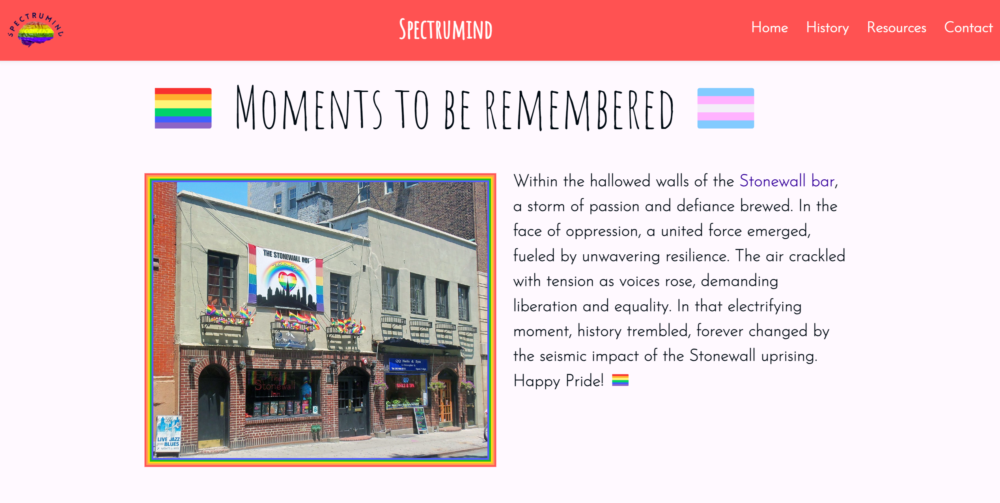

**Resources Page**

### Acceptance section
Another powerful feature implemented on the Resources page with a beautiful UI and friendly UX is the acceptance section where user can read about supporting acceptance and what means being supportive. This will help to raise awareness about LGBTQ+ community inside our society. Being accepted is very important for mental health.
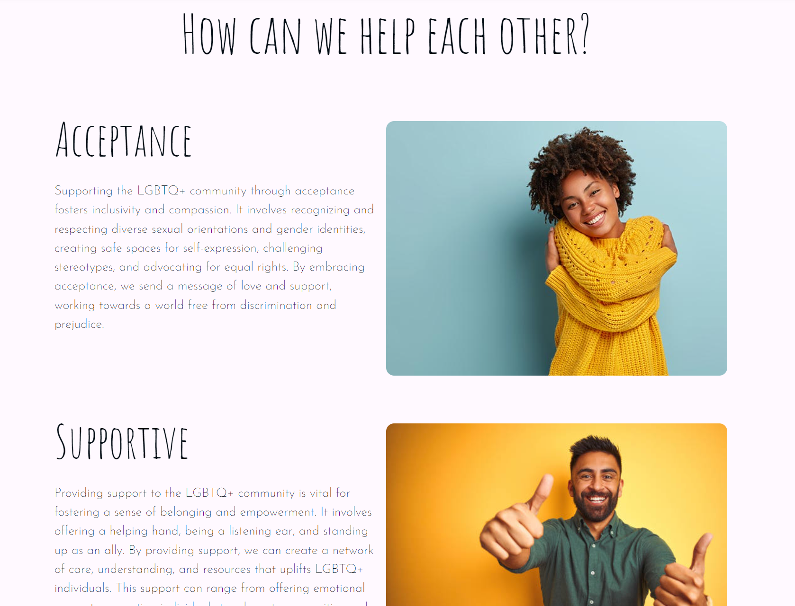

### Understanding LGBTQ+
This feature provides information about different aspects of LGBTQ+. To create this section was used a fully responsive carousel which contains 4 cards. Each one has an image related to the topic that represents and a link to additional resorces.
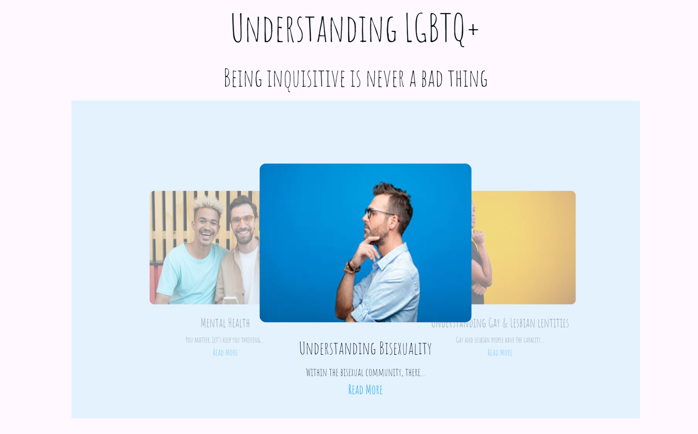

**Contact Page**

### Contact form
Contact form was created using HTML, CSS and Javascript. This form will help users send any queestions or contact for additional support the team. It is fully responsive and validation was added to each field.
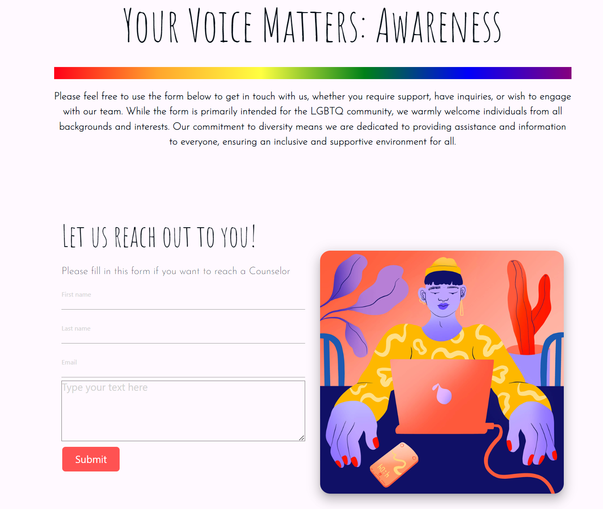

### FAQ section
The last feature implemented on this project is FAQ section  which provides users with most common FAQ (Frequently Asked Questions). This will help them get answers of some questions. As well additionally to this section contact informations are provided and a link to contact directly team for general inquiries.
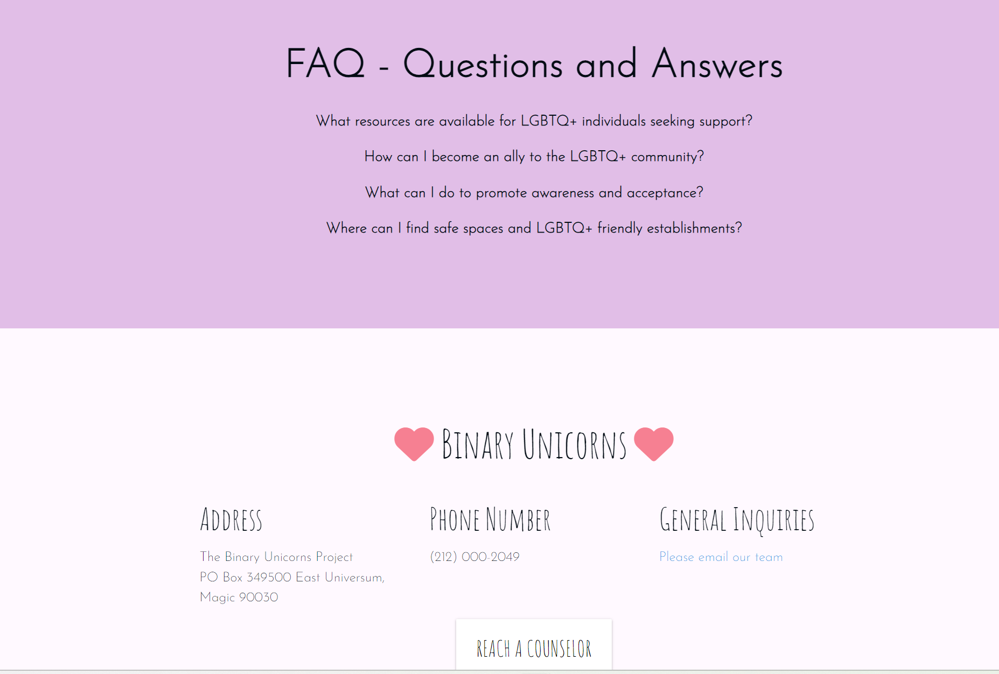

---

### Future Implementations

Features to implement on future:
* Create Login & Signup pages to provide user with account registrations to interect with webapp.
* User can create posts, leave comments, like posts or comments so like this can raise community interactions.
* Add more useful material about mental health and wellness.
* Add more links to resources that can help with mental health issues.

### Accessibility

Be an amazing developer and get used to thinking about accessibility in all of your projects!

This is the place to make a note of anything you have done with accessibility in mind. Some examples include:

Have you used icons and added aria-labels to enable screen readers to understand these?
Have you ensured your site meets the minimum contrast requirements?
Have you chosen fonts that are dyslexia/accessible friendly?

Code Institute have an amazing channel for all things accessibility (a11y-accessibility) I would highly recommend joining this channel as it contains a wealth of information about accessibility and what we can do as developers to be more inclusive.

[Back to top ⇧](#contents)

## Technologies Used

### Languages Used

* [HTML5](https://en.wikipedia.org/wiki/HTML)- was utilized in this project to structure the web pages in a semantically meaningful way, prioritizing better accessibility.
* [CSS3](https://en.wikipedia.org/wiki/CSS)- was used in this project to leverage its advanced styling capabilities and enhance the visual appearance of the website.
* [JavaScript](https://www.javascript.com/)- in this project, JavaScript code is kept minimal.
* [Python](https://www.python.org/)- was utilized to create backend code, views, urls on django framework.

### Frameworks, Libraries & Programs Used

* [Django](https://www.djangoproject.com/) was used as the framework which provides the necessary tools and functionalities for building full-stack web applications. Django enables rapid and secure development.
* [Materialize](https://materializecss.com/)- used to style the website through its classes, add responsiveness and interactivity and use ready components.
* [AOS](https://michalsnik.github.io/aos/)- used to add animation on scroll style to different components and sections on the site.
* [Cloudinary](https://cloudinary.com/)- was used to host the static files and media files for the website and use them in production environment, Heroku.
* [Git](https://git-scm.com/)- used for version control by utilizing the Gitpod terminal to commit code to Git and push to GitHub.
* [GitPod](https://www.gitpod.io/)- used as an IDE workspace to write code for this project.
* [Codeanywhere](https://codeanywhere.com/signin)- used as an IDE workspace to write code for this project.
* [GitHub](https://github.com/)- used to store the project's code after being pushed from Git version control and to create Issues & Project Kanban.
* [Heroku](https://id.heroku.com)- used to deploy the web application in production environment.
* [PostgreSQL](https://www.postgresql.org/)- Database used through Heroku.
* [Figma](https://www.figma.com/)- To build the mock ups for the project.
* [Google Chrome Developer Tools](https://developers.google.com/web/tools/chrome-devtools) was used to inspect page elements, debug, troubleshoot and test features and adjust property values. Using the Lighthouse extension installed in Chrome Browser, the performance report was generated.
* [Favicon.io](https://favicon.io/)- Used to generate favicon.

## Testing

A number of several manual tests were carried out on this project by all members. Due to lack of time was impossible to apply proper manual test or automated tests but pverall funcionality was cheked and main features making sure they all work properly:
 
### Manual Testing

**`Home, History, Resources, Contact Page`** 

| Feature | Expected Outcome | Testing Performed | Result | Pass/Fail |
| --- | --- | --- | --- | --- |
| Navbar links | Redirects the user to other pages on the site | Clicked on the link | The correct page is open and displayed | ✅ |
| External links | Redirects the user to external third part site | Clicked on the link | Successfully directed the user to the correct external site | ✅ |
| Contact form | Show validation message if user input wrong or empy data | Filled the form with wrong characters, empty strings and ints | Received correct required messages | ✅ |
| Contact form | Receive user input data in the database | Filled the form and clicked submit | Received the input data in our email | ✅ |
| All buttons - hover effect | When hovered over, all buttons should change color or have zoom animation to indicate that the button is hovered | Hovered over each button on the webpage | Each button displayed the correct style/animation when hovered over | ✅ |

**`Nav Section`**

| Feature | Expected Outcome | Testing Performed | Result | Pass/Fail |
| --- | --- | --- | --- | --- |
| Navbar links | Redirects the user to other pages on the site | Clicked on the link | The correct page is open and displayed | ✅ |


**`Footer Section`**

| Feature | Expected Outcome | Testing Performed | Result | Pass/Fail |
| --- | --- | --- | --- | --- |
| Navbar links | Redirects the user to other pages on the site | Clicked on the link | The correct page is open and displayed | ✅ |


### Automated Testing
**`Lighthouse`** 

Website has been tested with google lighthouse and the result is as below. In future is place to improve accessibility and performance. This website has a great SEO=100.

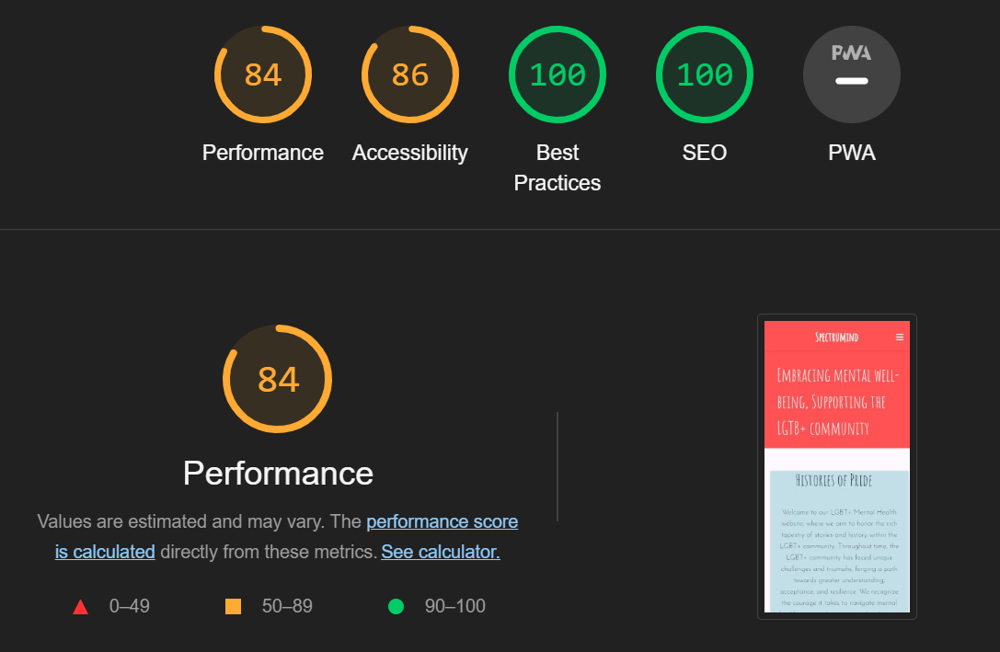

[Back to top ⇧](#contents)

## Deployment

## Creating the Django Project
* Go to the Code Institute Gitpod Full Template [Template](https://github.com/Code-Institute-Org/gitpod-full-template).
* Click on `Use This Template` button, then create new repository.
* Name our repository and click on `Create repository from template` button.
* Once the template is available in your repository click on `Gitpod` button.
* When the image for the template and the Gitpod are ready, open a new terminal to start a new Django App.
* Install Django and gunicorn: `pip3 install 'django<4' gunicorn`.
* Install supporting database libraries dj_database_url and psycopg2 library: `pip3 install dj_database_url==0.5.0 psycopg2`.
* Install Cloudinary libraries to manage static files: `pip install dj-3-cloudinary-storage`.
* Create file for requirements: `pip freeze --local > requirements.txt`.
* Create project: `django-admin startproject <your_project_name>.`
* Create app: `python manage.py startapp <your_app_name>`.
* Add app to list of `installed apps` in settings.py file: `'app_name'`.
* Migrate changes: `python manage.py migrate`.
* Test server works locally: `python manage.py runserver`.
* If the app has been installed correctly the window will display Django project - The install worked successfully! Congratulations!

## Create your Heroku app
* Navigate to [Heroku](https://id.heroku.com).
* Create a Heroku account by entering your email address and a password (or login if you have one already).
* Activate the account through the authentication email sent to your email account.
* Click the **new button** on the top right corner of the screen and select create a new app from the dropdown menu.
* Enter a unique name for the application.
* Select the appropriate region for the application.
* Click create app.
* Click Reveal Config Vars and add a new record with `DATABASE_URL`.
* Click Reveal Config Vars and add a new record with `PORT`.
* Click Reveal Config Vars and add a new record with the `DISABLE_COLLECTSTATIC = 1` (note: this must be either removed or set to 0 for final deployment).
* Next, scroll down to the Buildpack section, click `Add Buildpack` select python and click Save Changes.

## Set up Environment Variables
* In you IDE create a new env.py file in the top level directory.
* Add env.py to the .gitignore file.
* In env.py import the os library.
* In env.py add `os.environ["DATABASE_URL"]` = "Paste the link copied from Heroku DATABASE_URL".
* In env.py add `os.environ["SECRET_KEY"] = "Make up your own random secret key"`.
* In Heroku Settings tab Config Vars enter the same `SECRET_KEY` created in env.py by entering 'SECRET_KEY' in the box for 'KEY' and your randomly created secret key in the 'value' box.

## Setting up settings.py
* In your Django 'settings.py' file type:

 ```
 from pathlib import Path
 import os
 import dj_database_url

 if os.path.isfile("env.py"):
  import env
 ```
* Remove the default insecure secret key in settings.py and replace with the link to the secret key variable in Heroku by typing: `SECRET_KEY = os.environ.get(SECRET_KEY)`
* Comment out the `DATABASES` section in settings.py and replace with:
```
DATABASES = {
  'default': 
  dj_database_url.parse(os.environ.get("DATABASE_URL"))
  }`
```
* Create a Cloudinary account and from the 'Dashboard' in Cloudinary copy your url into the env.py file by typing: `os.environ["CLOUDINARY_URL"] = "cloudinary://<insert-your-url>"`
* In Heroku, click Reveal Config Vars and add a new record with the `CLOUDINARY_URL`
* Add Cloudinary libraries to the installed apps section of settings.py file:
 ```
 'cloudinary_storage'
 'django.contrib.staticfiles''
 'cloudinary'
 ```
* Connect Cloudinary to the Django app in `settings.py`:
```
STATIC_URL = '/static'
STATICFILES_STORAGE = 'cloudinary_storage.storage.StaticHashedCloudinaryStorage'
STATICFILES_DIRS = [os.path.join(BASE_DIR, 'STATIC')]
STATIC_ROOT = os.path.join(BASE_DIR, 'staticfiles')
MEDIA_URL = '/media/'
DEFAULT_FILE_STORAGE =
'cloudinary_storage.storage.MediaCloudinaryStorage'
* Link file to the templates directory in Heroku 
* Place under the BASE_DIR: TEMPLATES_DIR = os.path.join(BASE_DIR,
'templates')
```
* Change the templates directory to TEMPLATES_DIR. Place within the TEMPLATES array: `'DIRS': [TEMPLATES_DIR]`
* Add Heroku Hostname to ALLOWED_HOSTS: 
```ALLOWED_HOSTS = ['<Heroku_app_name>.herokuapp.com', 'localhost']```
* Create Procfile at the top level of the file structure and insert the following:
    ``` web: gunicorn PROJECT_NAME.wsgi ```

* Commit and push the code to the GitHub Repository.

## Heroku Deployment 
* Click Deploy tab in Heroku.
* Select Github as the deployment method.
* Confirm you want to connect to GitHub.
* Search for the repository name and click the connect button to link the heroku app with the Github repository. The box will confirm that heroku is connected to the repository.
* Scroll to the bottom of the deploy page and select the preferred deployment type.
* Click either Enable Automatic Deploys for automatic deployment when you push updates to Github or To manually deploy click the button 'Deploy Branch'. The default 'main' option in the dropdown menu should be selected in both cases. When the app is deployed a message 'Your app was successfully deployed' will be shown. Click 'view' to see the deployed app in the browser.

## Final Deployment

* When development is complete change the debug setting to: `DEBUG = False` in `settings.py` 
* In Heroku settings config vars change the `DISABLE_COLLECTSTATIC` value to 0
* Because DEBUG must be switched to True for development and False for production it is recommended that only manual deployment is used in Heroku. 
* To manually deploy click the button 'Deploy Branch'. The default 'main' option in the dropdown menu should be selected in both cases. When the app is deployed a message 'Your app was successfully deployed' will be shown. Click 'view' to see the deployed app in the browser.

----

[Back to top ⇧](#contents)

## Credits

- [freepik](https://www.freepik.com/) all images used in this project are free copyrights and they were downloaded from freepik.
- [Trevor Project](https://www.thetrevorproject.org/) website was used to create an idea for initial design and to get some of the content which was used in project.
- Code Institutes Full Stack Framework Module, mainly the 'blog' walkthrough project.
- [Google](https://www.google.com/) as a research tool.
- Some buttons shadow style was taken from [Css Scan](https://getcssscan.com/css-buttons-examples)

###  Acknowledgments

- **Thank you to all the team member for the hard work and cooperation.**

  - **Edmir Demaj** - [GitHub](https://github.com/Edmir-Demaj), [LinkedIn](https://www.linkedin.com/in/edmir-demaj-42a501196)
  Scrum Master/ Backend / Documentation
  - **Jody Murray** - [GitHub](https://github.com/JodyMurray), [LinkedIn](https://www.linkedin.com/in/jody-murray-4b6818234/)
  Design/ Frontend / Documentation
  - **Ignas Pilybas** - [GitHub](https://github.com/ignasvilkas), [LinkedIn](https://www.linkedin.com/in/ignaspilybas/)
  Design/ Frontend / Documentation
  - **Kim Bergstrom** - [GitHub](https://github.com/KimBergstroem), [LinkedIn](https://www.linkedin.com/in/kim-bergstrom-47704b5b/)
   Design/ Frontend / Documentation
  - **Mark Young** - [GitHub](https://github.com/Markyjay), [LinkedIn](https://www.linkedin.com/in/mark-young-4a90ab15/)
   Design/ Frontend / Documentation

