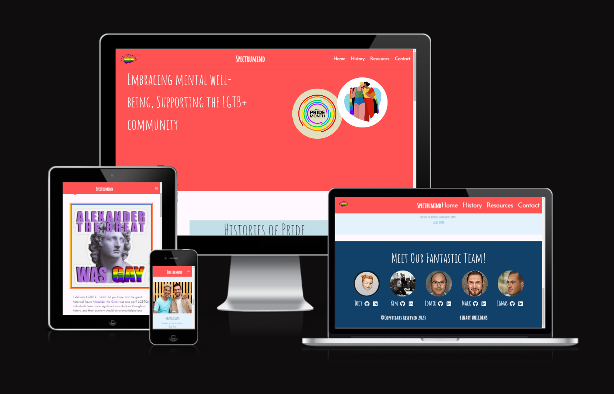

# Spectrumind - Introduction

**Welcome to Spectrumind** 

 This website is transformative online platform dedicated to promoting pride representation, raising awareness about mental health, and fostering well-being within the LGBTQ+ community and beyond. Our project is fueled by a deep commitment to creating a more inclusive and compassionate world, where every individual feels seen, accepted, and supported.

 **Our Mission** 
1. **Pride Representation:** At Spectrumind, we strive to celebrate the rich diversity of identities within the LGBTQ+ community. Our aim is to provide a safe space where individuals can freely express their authentic selves, share their stories, and find inspiration. Through empowering narratives, vibrant artwork, and engaging content, we aim to amplify voices that have been marginalized and break down societal barriers.
2. **Mental Health Awareness:** We recognize the profound impact that mental health has on the well-being of individuals, especially those within the LGBTQ+ community. Spectrumind is dedicated to shedding light on the unique challenges faced by this community and providing resources, support, and information to help navigate those struggles. Our goal is to reduce stigma, foster understanding, and create a culture of empathy and acceptance.
3. **Well-being and Empowerment:** Spectrumind believes in the power of holistic well-being. We aim to empower individuals by providing tools, resources, and guidance that promote self-care, personal growth, and resilience. Our goal is to nurture a community where mental, emotional, and physical well-being are prioritized, leading to a stronger and more vibrant community overall.

You can view the live site here: [Spectrumind](https://spectrumind-9674c855da30.herokuapp.com/)

---

## CONTENTS

* [User Experience](#user-experience-ux)
  * [User Stories](#user-stories)

* [Design](#design)
  * [Colour Scheme](#colour-scheme)
  * [Typography](#typography)
  * [Imagery](#imagery)
  * [Wireframes](#wireframes)

* [Features](#features)
  * [General Features on Each Page](#general-features-on-each-page)
  * [Future Implementations](#future-implementations)
  * [Accessibility](#accessibility)

* [Technologies Used](#technologies-used)
  * [Languages Used](#languages-used)
  * [Frameworks, Libraries & Programs Used](#frameworks-libraries--programs-used)

* [Deployment & Local Development](#deployment--local-development)
  * [Deployment](#deployment)
  * [Local Development](#local-development)
    * [How to Fork](#how-to-fork)
    * [How to Clone](#how-to-clone)

* [Testing](#testing)
  * [Manual Testing](#manual-testing)
  * [Automated Testing](#automated-testing)

* [Credits](#credits)
  * [Code Used](#code-used)
  * [Media](#media)
  * [Acknowledgments](#acknowledgments)

---

## User Experience (UX)

A group of unlikely coders with various abilities came together to produce a website dedicated to representing the LGBTQ+ community and bring awareness to others about the struggles encountered by the community throughout history and up to the current day.
The concept of the name Spectrumind developed from the idea of connecting mental wellness and the human brain and associating the light spectrum to a community defined by its rainbow colors.
Key information for the site
•	What does it mean to be a part of the LGBTQ+.
•	How can we support members of the LGBTQ+ community who suffer with feeling ostracized by society.
•	Where can we learn about the history and accomplishments of the community as well as important figures and icons.
•	What can we do to help people who struggle to understand their role in the community.
•	When do events happen throughout the year that promote awareness.

### User Stories

**Users Goals**

*	To be able to view the site on a range of device sizes.
*	To make it easy for people who wish to learn more about the LGBTQ+ community and make the site more accessible and understandable.
*	To make the content and information clear, easy and concise for all users.
*	To provide accessible and user-friendly links that help those in need of council.  
First Time Visitor Goals
*	I want to find out more about the LGBTQ+ community and how I can support them.
*	I want to be able to easily navigate through the website's pages, so that I can find the information I'm looking for.
*	I want to be able to find their social media profiles with ease.
Returning Visitor Goals
*	I want to find up to date information on current LGBTQ+ news and events.
*	I want to be able to find necessary links to get help or find someone to talk to, so that I can get help if needed for my mental health.
Frequent Visitor Goals
*	I want to be able to follow current events regarding the LGBTQ+ community.

**Admin Goals**

*	Create an early deployment to be able to deliver early results to client and users following Agile principles.
*	Set up the backend so i can able to create a site admin dashboard and manage page.

## Design

### Colour Scheme

The color palette comprising FF5252 (red), E1BEE7 (pink), 114069 (navy blue), C2DFE8 (light blue), and BC5BBC (purple) was selected for the project "SpectrumInd" to represent LGBTQ pride for several reasons. Firstly, the color red (FF5252) is often associated with love, passion, and solidarity, reflecting the strong emotions and sense of unity within the LGBTQ community. The pink shade (E1BEE7) symbolizes inclusivity, tenderness, and understanding, promoting a welcoming atmosphere for diverse identities. Navy blue (114069) signifies strength and stability, highlighting the resilience and courage of LGBTQ individuals. Light blue (C2DFE8) represents serenity, tranquility, and harmony, underscoring the peaceful coexistence and acceptance of different sexual orientations and gender identities. Lastly, purple (BC5BBC) embodies creativity, pride, and diversity, reflecting the unique and vibrant spectrum of LGBTQ experiences. Together, this color palette embodies the values of the LGBTQ community and visually represents the pride and celebration of their identities within the "SpectrumInd" project.

### Typography

Google Fonts was used for the following fonts

Amatic and Josefin fonts are the main fonts used throughout the whole website with Sans Serif as the fallback font in case for any reason the font isn't being imported into the site correctly. Amatic and Josefin are clean fonts used frequently in programming, so they are both attractive and appropriate.

### Imagery

All images used on this project are free copyrights. They are used within the site has been chosen to showcase the LGBTQ+ community. The images are also used to add visual interest to the website and to help break up different sections of the page. Imagery is relevant to the content and mission of the website and is also appropriately sized and optimized for web use to ensure fast page loading times. 

### Wireframes

All of the mock up designs for the web app were created using [Figma](https://www.figma.com/), a popular design tool known for its versatility and collaborative features. During design stage was kept in mind the principles of UX (User Experience) and UI (User Interface) design throughout the process to ensure that designs are intuitive, user-friendly, and visually appealing. Additionally, the mock up designs are responsive and optimized for use on tablets and mobile devices, to provide a seamless experience across different screen sizes. Personally, I find it very helpful to create a mockup design rather than a wireframe when I began a project, it helps a lot with styling, colours, layout during development.

Home Page:

History Page:

Resources Page:

Contact Page:

--- 

## Features

**Home Page**
### Navbar
On the landing page, users will be presented with a visually appealing and user-friendly navbar positioned at the very top. This navbar contains all the necessary links and accessibility options for easy navigation and is fully responsive. On the very left side is positioned the Logo of the website. Navbar is kept same in all the pages for ease of navigation.

### Hero Section
Creating a strong first impression with the user is crucial, and to achieve this, a hero image with 100% screen width and 60% screen height was employed. This hero image acts as an introduction to site, displaying two distinct images accompanied by engaging heading that effectively communicate the purpose and essence of the web app. The design is fully responsive, ensuring seamless adaptation. 

### Histories of Pride
Histories of Pride is another feature on home page providing to users more information about LGBTQ+ community and sharing the story journey. This section is center aligned and has a button to redirect to histroy page in order to get more information about this community.

### Reach out
A vry important feature laying on home page is reachout to us section. This section consists on an image representin pride with colours and smiles, showing the importance of staying healthy and happy by being accepted. 'Talk to us' button will redirect to Resources page for additional professional resources seeking help about mental health and wellness.

### Footer

Footer is another feature used on this website. It always stick to the bottom of the page with a strong blue background which aligns well with LGBTQ+ flag colours. This feature contains all team members who worked to built this site and their links to GitHub and LinkedIn profiles. As well includes copyrights and the team name Binary uNICORNS. 

---

**History Page**

### History section
On the second page which is History page user will be presented 

### Future Implementations

What features would you like to implement in the future on your site? Would you like to add more pages, or create login functionality? Add these plans here.

<!--> To DO <--> 
### Accessibility

Be an amazing developer and get used to thinking about accessibility in all of your projects!

This is the place to make a note of anything you have done with accessibility in mind. Some examples include:

Have you used icons and added aria-labels to enable screen readers to understand these?
Have you ensured your site meets the minimum contrast requirements?
Have you chosen fonts that are dyslexia/accessible friendly?

Code Institute have an amazing channel for all things accessibility (a11y-accessibility) I would highly recommend joining this channel as it contains a wealth of information about accessibility and what we can do as developers to be more inclusive.

## Technologies Used

<!--> Completed <--> 
### Languages Used

HTML, CSS, Python, Dockerfile, JavaScript & Procfile.

<!--> Completed <--> 
### Frameworks, Libraries & Programs Used

•	Git - For version control.
•	Github - To save and store the files for the website.
•	Materialize Framework.
•	Django.
•	Heroku - For deployment.
•	Code anywhere, git pod and VS Code - For workspaces.
•	Google Fonts - To import the fonts used on the website.
•	Font Awesome - For the iconography on the website.
•	Google Dev Tools - To troubleshoot and test features, solve issues with responsiveness and styling.
•	Favicon.io - Was used to create favicon.
•	Figma - Was used for wireframes and mockups.

## Deployment & Local Development

<!--> Need to add deployment link <--> 
### Deployment

The site is deployed using GitHub Pages. Visit the deployed site [here.](#) To deploy using GitHub pages:

1. Login or Sign Up to GitHub.
2. Open the project repository.
3. Click on "Settings" on the navigation bar under the repository title.
4. Click on "Pages" in the left hand navigation panel.
5. Under "Source", choose which branch to deploy. This should be Main for newer repositories (older repositories may still use Master).
6. Choose which folder to deploy from, usually "/root".
7. Click "Save", then wait for it to be deployed. It can take some time for the page to be fully deployed.
8. Your URL will be displayed above "Source".

### Local Development

<!--> Completed <--> 
#### How to Fork

To fork the repository:

1. Log in (or sign up) to Github.
2. Go to the repository for this project, [spectrumind-hackathon-2023](https://github.com/Edmir-Demaj/hackathon-june-23).
3. Click the Fork button in the top right corner.

<!--> Completed <--> 
#### How to Clone

To clone the repository:

1. Log in (or sign up) to GitHub.
2. Go to the repository for this project, [spectrumind-hackathon-2023](https://github.com/Edmir-Demaj/hackathon-june-23).
3. Click on the code button, select whether you would like to clone with HTTPS, SSH or GitHub CLI and copy the link shown.
4. Open the terminal in your code editor and change the current working directory to the location you want to use for the cloned directory.
5. Type 'git clone' into the terminal and then paste the link you copied in step 3. Press enter.

## Testing

A number of manual tests were carried out on this project by all members:
 
### Manual Testing

**`Home, History, Resources, Contact Page`** 

| Feature | Expected Outcome | Testing Performed | Result | Pass/Fail |
| --- | --- | --- | --- | --- |
| Navbar links | Redirects the user to other pages on the site | Clicked on the link | The correct page is open and displayed | ✅ |
| External links | Redirects the user to external third part site | Clicked on the link | Successfully directed the user to the correct external site | ✅ |
| Contact form | Show validation message if user input wrong or empy data | Filled the form with wrong characters, empty strings and ints | Received correct required messages | ✅ |
| Contact form | Receive user input data in the database | Filled the form and clicked submit | Received the input data in our email | ✅ |
| All buttons - hover effect | When hovered over, all buttons should change color or have zoom animation to indicate that the button is hovered | Hovered over each button on the webpage | Each button displayed the correct style/animation when hovered over | ✅ |

**`Nav Section`**

| Feature | Expected Outcome | Testing Performed | Result | Pass/Fail |
| --- | --- | --- | --- | --- |
| Navbar links | Redirects the user to other pages on the site | Clicked on the link | The correct page is open and displayed | ✅ |

**`Footer Section`**

| Feature | Expected Outcome | Testing Performed | Result | Pass/Fail |
| --- | --- | --- | --- | --- |
| Navbar links | Redirects the user to other pages on the site | Clicked on the link | The correct page is open and displayed | ✅ |

### Automated Testing
**`Lighthouse`** 

Website has been tested with google lighthouse and the result is as below.

  

**`JSHint`** 

  

&nbsp;

## Credits

- All images were taken using 
- Inspiration was taken from
- API for submit form was taken from

### Code Used

If you have used some code in your project that you didn't write, this is the place to make note of it. Credit the author of the code and if possible a link to where you found the code. You could also add in a brief description of what the code does, or what you are using it for here.

###  Media

If you have used any media on your site (images, audio, video etc) you can credit them here. I like to link back to the source where I found the media, and include where on the site the image is used.
  
###  Acknowledgments

- Thank you to all the team member for the hard work and cooperation.
  - **Edmir Demaj** - [GitHub](https://github.com/Edmir-Demaj), [LinkedIn](https://www.linkedin.com/in/edmir-demaj-42a501196)
  - **Jody Murray** - [GitHub](https://github.com/JodyMurray), [LinkedIn](https://www.linkedin.com/in/jody-murray-4b6818234/)
  - **Ignas Pilybas** - [GitHub](https://github.com/ignasvilkas), [LinkedIn](https://www.linkedin.com/in/ignaspilybas/)
  - **Kim Bergstrom** - [GitHub](https://github.com/KimBergstroem), [LinkedIn](https://www.linkedin.com/in/kim-bergstrom-47704b5b/)
  - **Mark Young** - [GitHub](https://github.com/Markyjay), [LinkedIn](https://www.linkedin.com/in/mark-young-4a90ab15/)

This section will call out each team member for a particularly valuable contribution to the project
